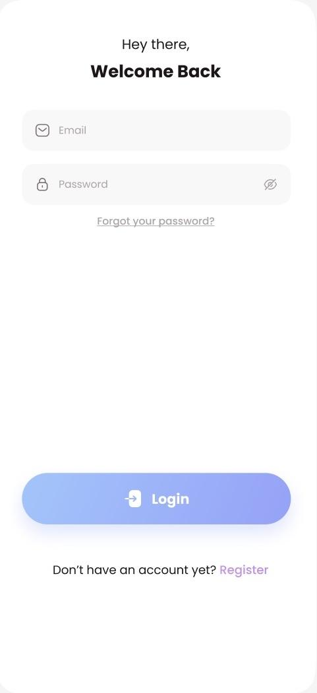
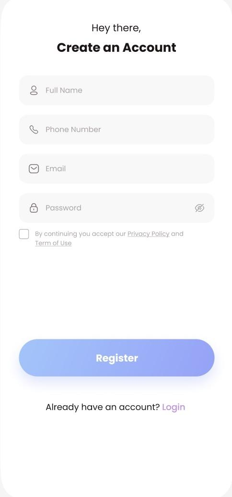
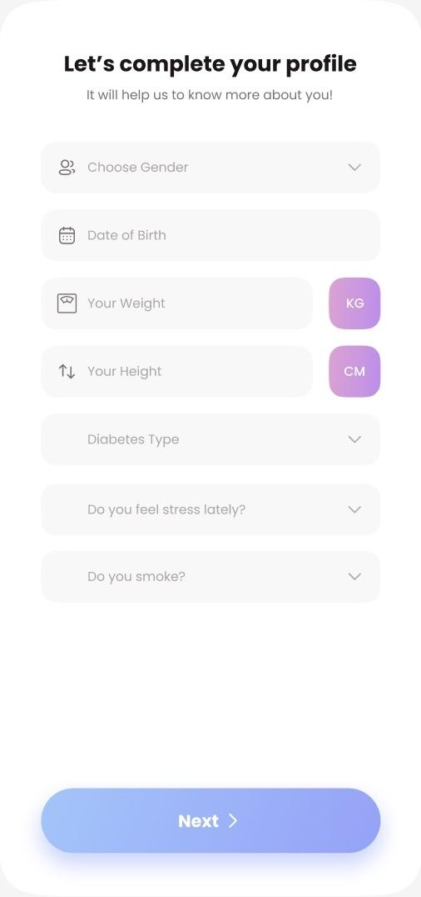
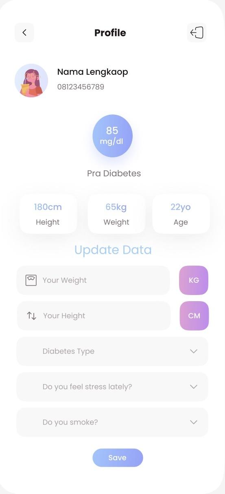
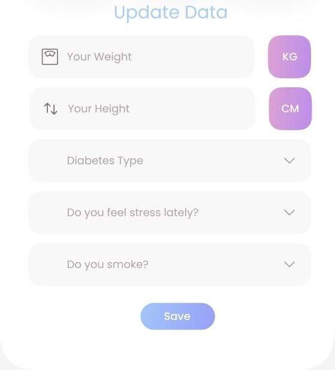
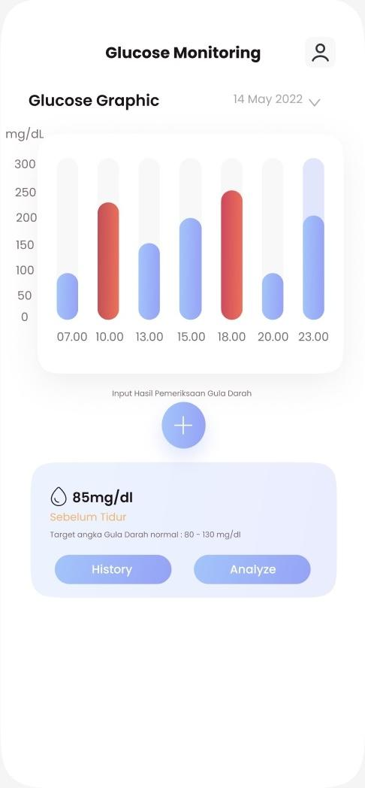
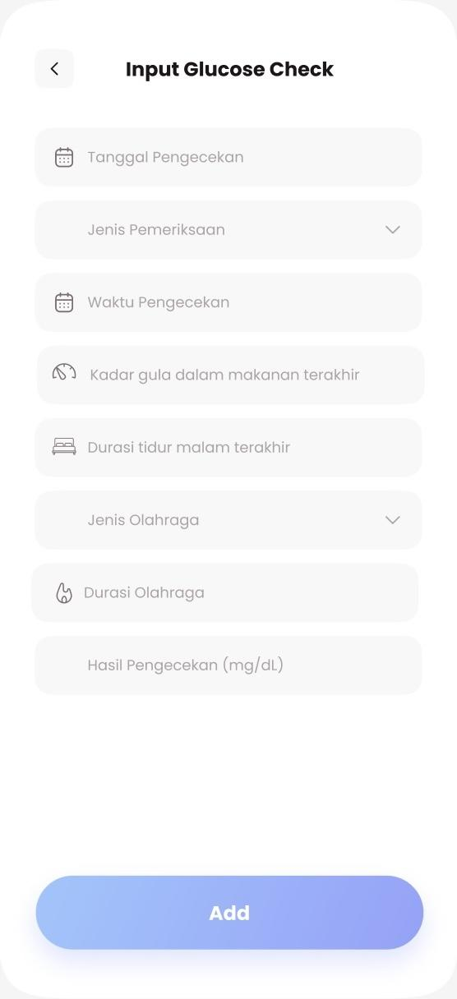
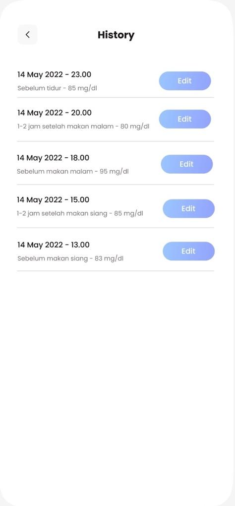
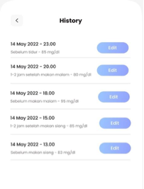
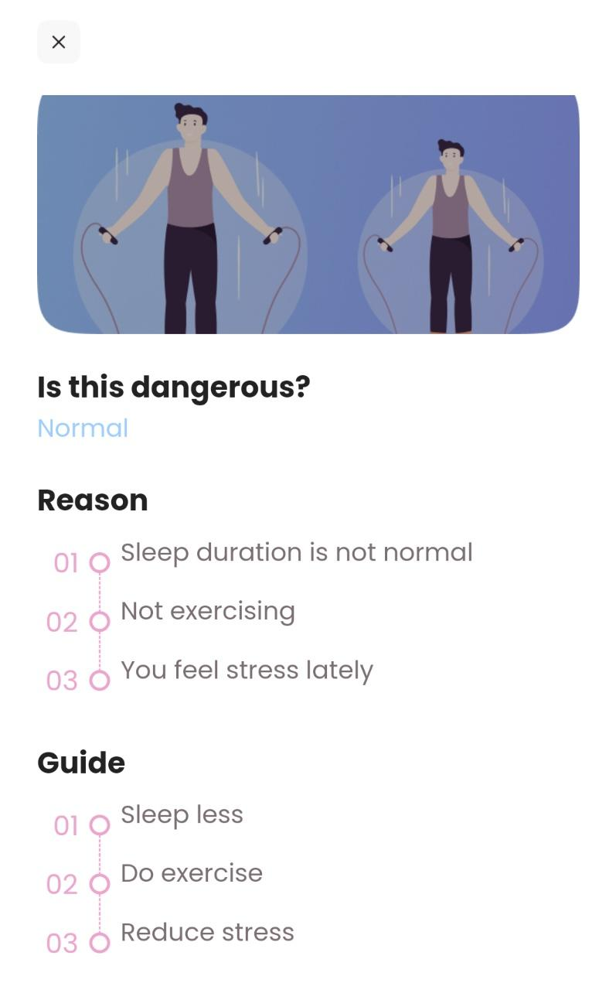

# DiabetBuddy

DiabetBuddy is a mobile health tracking app built with Flutter to help users log blood glucose checks, review daily trends, and manage profile data related to diabetes monitoring.

This project was designed as a full mobile app experience with authentication, onboarding, historical records, data visualization, and health-status feedback connected to a REST API.

## Project Subtitle

Mobile diabetes monitoring application focused on glucose tracking, health data input, and progress visualization.

## Author

Vanessa Rasubala

If you want to use this repository in your portfolio, you can add your GitHub, LinkedIn, or portfolio links here before publishing.

## Overview

The app guides users from sign in to profile setup, then into a glucose monitoring dashboard. Users can record new measurements, review previous entries, inspect charts for a selected date, and view analysis results with reasons and guidance.

## Demo

- Demo video: add your project walkthrough link here
- Screenshots are included below in the repository gallery

## Screenshot Gallery

### Authentication




### Onboarding And Profile





### Glucose Tracking






### Analysis



## Key Features

- User authentication with login and registration flows
- Profile creation and profile update flow for diabetes-related personal data
- Daily glucose monitoring dashboard with chart visualization
- Glucose input form with contextual health factors such as meal sugar level, sleep duration, sport type, and sport duration
- History screen for reviewing and editing previous glucose records
- Analysis screen that presents status, reasons, and guidance based on submitted data
- Local persistence for session state using shared preferences
- Multi-language support with English and Indonesian localization
- Responsive UI using Flutter layout utilities

## Tech Stack

- Flutter
- Dart
- Provider for state management
- GetIt for dependency injection
- Dio for API communication
- Fluro for routing
- Shared Preferences for lightweight local storage
- FL Chart for glucose data visualization

## Architecture Notes

The project follows a layered structure:

- `lib/data` for models, repositories, and remote data access
- `lib/provider` for application state and business logic
- `lib/view` for screens and reusable UI components
- `lib/helper` and `lib/utill` for routing, constants, styling, and utilities

This keeps presentation, state, and data access responsibilities separated and easier to maintain.

## Screens Included

- Authentication
- Profile setup and profile management
- Home dashboard with glucose graph
- Add glucose record
- Edit glucose record
- Glucose history
- Analysis and recommendation view

## API Integration

The app is configured to consume a backend API from:

`https://diabetbuddy.com/api/`

Current endpoints referenced in the project include authentication, profile, glucose records, monitoring history, and analysis services.

## Running the Project

### Prerequisites

- Flutter SDK
- Dart SDK
- Android Studio or Xcode
- A connected emulator or physical device

### Setup

1. Clone the repository.
2. Run `flutter pub get`.
3. Create `android/local.properties` if it does not already exist.
4. Add your local SDK paths to `android/local.properties`.
5. If you use Google Maps on Android, add:

```properties
google.maps.apiKey=YOUR_ANDROID_API_KEY
```

6. Run the app with `flutter run`.

## Repository Notes

- Generated and machine-specific files were intentionally excluded from this GitHub-ready version.
- Sensitive local configuration should stay out of version control.
- The Android Google Maps key is read from `android/local.properties` and is not committed in this export.

## Portfolio Context

This project highlights:

- End-to-end Flutter app development
- Mobile UI implementation for health-focused workflows
- REST API integration
- State management and dependency injection
- Data visualization for user-facing insights
- Practical handling of app setup and environment-sensitive configuration

## Future Improvements

- Add screenshots or demo GIFs to showcase the UI
- Improve automated testing coverage
- Migrate package versions to a modern Flutter SDK
- Add secure environment management for API secrets across platforms
